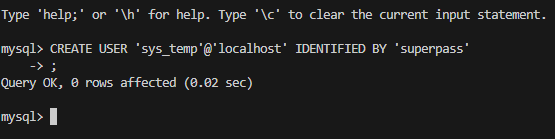
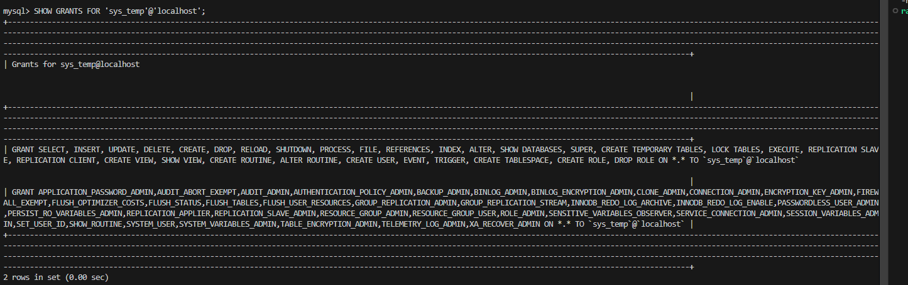

# sdb-homeworks12-02

# Домашнее задание «Работа с данными (DDL/DML)»


### Задание 1
1.1. Поднимите чистый инстанс MySQL версии 8.0+. Можно использовать локальный сервер или контейнер Docker.


1.2. Создайте учётную запись sys_temp.


```
CREATE USER 'sys_temp'@'localhost' IDENTIFIED BY 'superpass';
```



1.3. Выполните запрос на получение списка пользователей в базе данных. (скриншот)

```
SELECT user, host, plugin FROM mysql.user;
```


1.4. Дайте все права для пользователя sys_temp.

```
GRANT ALL PRIVILEGES ON *.* TO 'sys_temp'@'localhost';
```

Если не прогрузило:

```
FLUSH PRIVILEGES;
```


1.5. Выполните запрос на получение списка прав для пользователя sys_temp. (скриншот)

```
SHOW GRANTS FOR 'sys_temp'@'localhost';
```



1.6. Переподключитесь к базе данных от имени sys_temp.

```
mysql -u sys_temp -p
```


Для смены типа аутентификации с sha2 используйте запрос:

```sql
ALTER USER 'sys_test'@'localhost' IDENTIFIED WITH mysql_native_password BY 'password';
```
1.6. По ссылке https://downloads.mysql.com/docs/sakila-db.zip скачайте дамп базы данных.

1.7. Восстановите дамп в базу данных.

1.8. При работе в IDE сформируйте ER-диаграмму получившейся базы данных. При работе в командной строке используйте команду для получения всех таблиц базы данных. (скриншот)


```
wget https://downloads.mysql.com/docs/sakila-db.zip
unzip sakila-db.zip
cd sakila-db/
```

```
mysql -u sys_temp -p < sakila-schema.sql
mysql -u sys_temp -p < sakila-data.sql
```

```
SHOW DATABASES;
USE sakila; SHOW TABLES;
```
*Результатом работы должны быть скриншоты обозначенных заданий, а также простыня со всеми запросами.*


### Задание 2
Составьте таблицу, используя любой текстовый редактор или Excel, в которой должно быть два столбца: в первом должны быть названия таблиц восстановленной базы, во втором названия первичных ключей этих таблиц. Пример: (скриншот/текст)
```
Название таблицы | Название первичного ключа
customer         | customer_id
```

### Ответ на задание 2
+---------------------------------+--------------------------------------------------+
| Название таблицы                | Название первичного ключа                        |
+---------------------------------+--------------------------------------------------+
| actor                           | actor_id                                         |
| address                         | address_id                                       |
| category                        | category_id                                      |
| city                            | city_id                                          |
| country                         | country_id                                       |
| customer                        | customer_id                                      |
| film                            | film_id                                          |
| film_actor                      | actor_id,film_id                                 |
| film_category                   | film_id,category_id                              |
| film_text                       | film_id                                          |
| inventory                       | inventory_id                                     |
| language                        | language_id                                      |
| payment                         | payment_id                                       |
| rental                          | rental_id                                        |
| staff                           | staff_id                                         |
| store                           | store_id                                         |
+---------------------------------+--------------------------------------------------+

```
SELECT 
    TABLE_NAME as 'Название таблицы',
    GROUP_CONCAT(COLUMN_NAME) as 'Название первичного ключа'
FROM INFORMATION_SCHEMA.KEY_COLUMN_USAGE 
WHERE TABLE_SCHEMA = 'sakila' 
    AND CONSTRAINT_NAME = 'PRIMARY'
GROUP BY TABLE_NAME
ORDER BY TABLE_NAME;
```


### Задание 3*
3.1. Уберите у пользователя sys_temp права на внесение, изменение и удаление данных из базы sakila.

3.2. Выполните запрос на получение списка прав для пользователя sys_temp. (скриншот)

*Результатом работы должны быть скриншоты обозначенных заданий, а также простыня со всеми запросами.*

### Ответ на задание 3*


```
REVOKE INSERT, UPDATE, DELETE ON *.* FROM 'sys_temp'@'localhost';

SHOW GRANTS FOR 'sys_temp'@'localhost';
```


REVOKE INSERT ON *.* FROM 'sys_temp'@'localhost'; - не отзывает  UPDATE DELETE